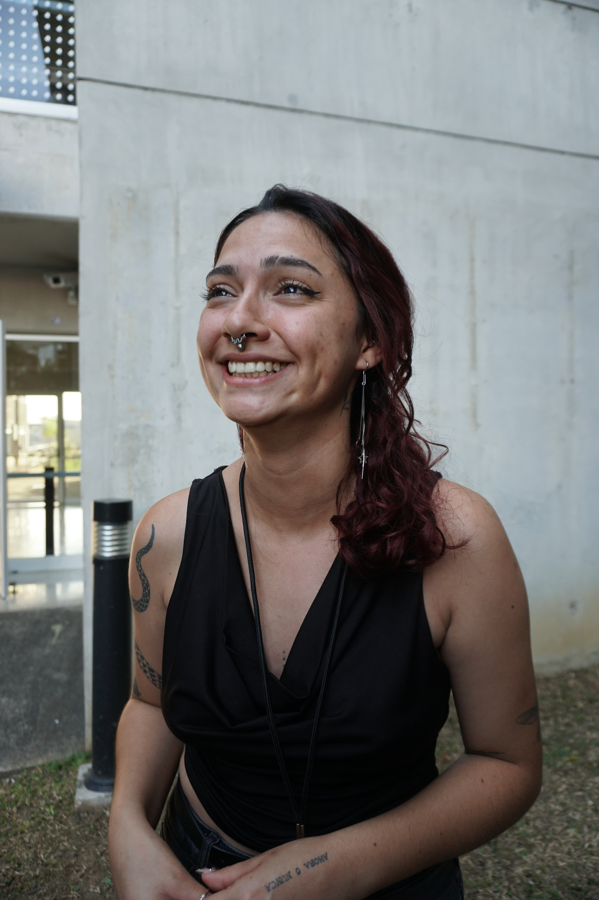

::: {.perfil-superior}

::: {.perfil-foto}

{fig-alt="Fotografía de perfil"}

:::

::: {.perfil-info}

# Wendy Fonseca Quirós

## Estudiante de Bachillerato en Biología tropical

Escuela de Ciencias Biológicas  
Universidad Nacional, Costa Rica

::: {.enlaces-perfil}

[<i class="bi bi-envelope-fill"></i> Correo](mailto:wendy.fonseca.quiros@est.una.ac.cr)

[<i class="bi bi-github"></i> GitHub](https://github.com/WendyRE15)

[<i class="bi bi-person-badge-fill"></i> ORCID](https://orcid.org/0009-0001-1477-3018)

[<i class="bi bi-linkedin"></i> LinkedIn](https://linkedin.com/in/wendy-fonseca-quiros-0901b4405)

:::

:::

:::

---

## Biografía

Estudiante de biología tropical, herpetologa. 

---

## Áreas de interés

- Herpetología
- Conservación
- Biogeografía

---

## Habilidades

- R
- QGIS
- Epicollect5

---

## Formación académica

**Universidad Nacional (UNA)**

Bachillerato en Biología

*2022 – Presente*
