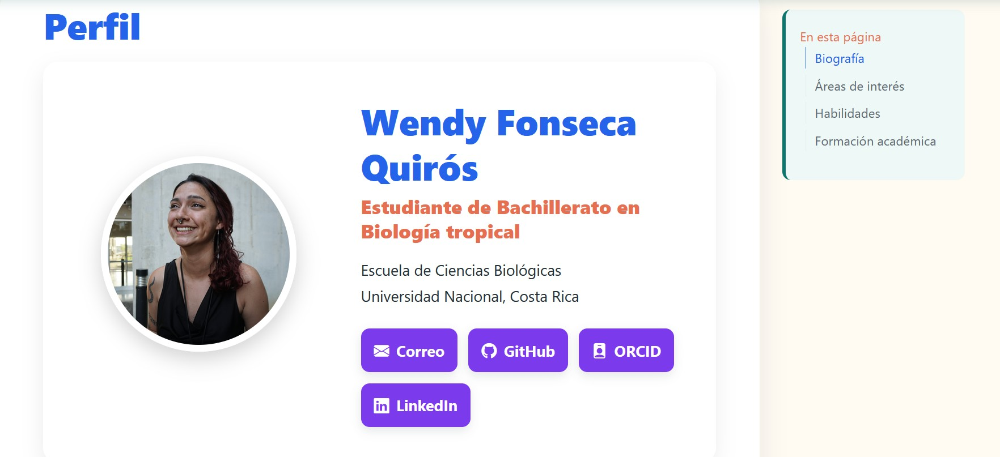

## Objetivo

Crear un sitio web personalizado.

## Materiales y herramientas

-   RStudio
-   Quarto
-   Git
-   GitHub

## Procedimiento

Explique de forma ordenada los pasos realizados durante la práctica. Paso 1.

## Resultados

Creacion exitosa de un sitio web.

## Figuras y tablas

## Reflexión final

Responda brevemente:

-   ¿Qué aprendí?
-   ¿Qué dificultad encontré? Las extensiones hay que cmabiarlas las de las fotos
-   ¿Cómo podría aplicar esta herramienta o conocimiento en otro contexto?
